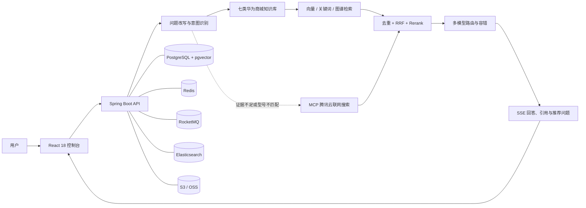

<div align="center">

# 知源 AI

面向华为商城场景的 Agentic RAG 智能导购平台

[](https://www.oracle.com/java/technologies/javase/jdk17-archive-downloads.html)
[](https://spring.io/projects/spring-boot)
[](https://react.dev/)
[](https://github.com/pgvector/pgvector)
[](./LICENSE)

</div>

> [!IMPORTANT]
> 本项目是基于公开资料构建的学习与工程实践项目，并非华为官方产品，也不代表华为商城。系统返回的商品价格、库存、优惠、权益及服务政策仅供参考，最终信息以华为商城官方页面和结算页为准。

## 项目简介

知源 AI 是一个基于 Java 与 React 构建的华为商城智能导购系统。项目以领域知识库为主要证据来源，通过问题改写、树形意图识别、多知识库路由、混合检索、RRF 融合和 Rerank，为用户提供商品参数、选购对比、鸿蒙生态兼容及售后政策等问答能力。

当知识库证据不足、商品型号不匹配或信息已经过期时，系统可以按策略回退到 MCP 工具，查询华为商城及华为消费者业务官网的公开页面。所有回答均强调证据来源与时效边界，不将公开页面信息包装为实时交易结果。

## 核心能力

- **华为商城垂直知识库**：覆盖商品参数、选购指南、鸿蒙生态兼容、配送安装、退换退款、保修维修和发票等七类知识。
- **知识库优先、MCP 回退**：先检索本地知识库，仅在证据分数、相关分块数或实体匹配不满足要求时调用联网工具。
- **多路混合检索**：支持 pgvector / Milvus 向量检索、Elasticsearch 关键词检索、LightRAG 图谱检索和联网搜索通道。
- **检索结果治理**：支持结果去重、加权 RRF 融合、候选池控制、Rerank 精排与引用元数据补全。
- **问题理解与意图路由**：支持查询词映射、问题重写与拆分、树形多级意图识别和多 Collection 定向检索。
- **模型路由与容错**：支持百炼、SiliconFlow、AIHubMix、Ollama 等模型来源，以及模型档位、首包探测、故障熔断和候选降级。
- **知识入库闭环**：支持文档上传、结构化分块、Embedding、异步任务、远程刷新和节点级执行日志。
- **流式问答与会话记忆**：通过 SSE 输出思考、正文、来源和推荐问题，并结合近期对话与持久化摘要维护上下文。
- **完整管理后台**：提供知识库、文档分块、意图树、查询词映射、入库任务、模型设置、用户、Trace 和审计日志管理。

## 系统架构



后端采用模块化单体架构，将通用基础设施、AI 供应商适配、RAG 业务编排和 MCP 工具服务分离，便于独立替换模型、检索通道和对象存储实现。

## 知识库范围

| 知识目录 | 意图范围 | Collection |
| --- | --- | --- |
| `01_参数与卖点_KB` | 商品参数、稳定卖点、商品公开快照 | `hwmallproduct` |
| `02_鸿蒙生态兼容_KB` | 手机、平板、电脑、穿戴与配件兼容 | `hwmallcompat` |
| `03_使用与选购指南_KB` | 场景选购、产品对比与使用指南 | `hwmallguide` |
| `04_配送与安装_KB` | 发货、配送、签收与安装 | `hwmalldelivery` |
| `05_退货换货与退款_KB` | 七天无理由、退换货与退款 | `hwmallreturn` |
| `06_保修与维修_KB` | 保修政策、寄修与维修准备 | `hwmallwarranty` |
| `07_发票_KB` | 发票开具、修改、换开与查验 | `hwmallinvoice` |

知识库的完整范围、数据边界和 Collection 映射见 [`resources/docs/knowledge/README.md`](./resources/docs/knowledge/README.md)。

## 技术栈

| 分类 | 技术 |
| --- | --- |
| 后端 | Java 17、Spring Boot 3.5.7、Spring MVC、Maven |
| 数据访问 | PostgreSQL、pgvector、MyBatis-Plus、HikariCP |
| 检索 | pgvector / Milvus、Elasticsearch、LightRAG、RRF、Rerank |
| AI 与工具 | 大模型兼容接口、Embedding、VLM、MCP Java SDK、MinerU |
| 中间件 | Redis、Redisson、RocketMQ |
| 对象存储 | S3 兼容存储（RustFS / MinIO）或阿里云 OSS |
| 认证与治理 | Sa-Token、分布式限流、幂等、Trace、审计日志 |
| 前端 | React 18、TypeScript、Vite 5、Tailwind CSS、Radix UI、Zustand |

## 项目结构

```text
.
├── bootstrap                 # Spring Boot 主应用、RAG 业务、知识库与管理 API
├── framework                 # 统一响应、异常、认证上下文、幂等、MQ、Trace、SSE
├── infra-ai                  # Chat / Embedding / Rerank / VLM 客户端与模型路由
├── mcp-server               # 独立 MCP 工具服务与腾讯云联网搜索实现
├── frontend                 # React 用户问答界面与管理后台
├── resources
│   ├── database             # PostgreSQL 全量初始化与版本升级脚本
│   ├── docker               # RocketMQ、Milvus、LightRAG 等 Compose 配置
│   └── docs/knowledge       # 华为商城场景知识库及元数据
├── scripts/kb               # 知识采集、校验、快照写入与批量导入脚本
├── docs                     # 示例与版本说明
└── pom.xml                  # Maven 多模块父工程
```

## 环境要求

### 开发工具

- JDK 17
- Node.js 18+ 与 npm
- Docker 与 Docker Compose（推荐）
- Git

### 默认运行依赖

- PostgreSQL，并安装 `pgvector` 扩展
- Redis
- RocketMQ 5.x
- Elasticsearch（默认启用关键词检索）
- S3 兼容对象存储或阿里云 OSS
- 至少一组可用的 Chat、Embedding 和 Rerank 模型配置

Milvus、LightRAG、MinerU 和 MCP 联网搜索属于可选能力，可按实际场景启用。

### 默认端口

| 服务 | 默认端口或地址 |
| --- | --- |
| 前端开发服务 | `http://localhost:5173` |
| 后端 API | `http://localhost:9090/api/ragent` |
| MCP Server | `http://localhost:9099` |
| PostgreSQL | `5432` |
| Redis | `6379` |
| RocketMQ NameServer | `9876` |
| Elasticsearch | `9200` |
| Milvus（可选） | `19530` |
| LightRAG（可选） | `9621` |

## 快速开始

### 1. 克隆项目

```bash
git clone https://github.com/yiersan218/-Ai.git
cd ./-Ai
```

### 2. 准备基础服务

请先启动 PostgreSQL、Redis、Elasticsearch 和 S3 兼容对象存储。默认关键词索引使用 `ik_max_word` / `ik_smart`，因此 Elasticsearch 需要安装与其版本匹配的 IK 分词插件。仓库提供了 RocketMQ Compose 配置：

```bash
docker compose -f resources/docker/rocketmq-stack-5.2.0.compose.yaml up -d
```

如果将向量存储从默认的 pgvector 切换为 Milvus，可以启动：

```bash
docker compose -f resources/docker/milvus-stack-2.6.6.compose.yaml up -d
```

低配环境可参考 [`resources/docker/lightweight/README.md`](./resources/docker/lightweight/README.md)。

### 3. 初始化数据库

```bash
psql -U postgres -c "CREATE DATABASE ragent;"
psql -U postgres -d ragent -f resources/database/schema_pg.sql
psql -U postgres -d ragent -f resources/database/init_data_pg.sql
```

`schema_pg.sql` 会创建 pgvector 扩展及最新表结构。新环境只需执行上述两个 SQL 文件；已有环境请按 [`resources/database/README.md`](./resources/database/README.md) 的说明执行增量脚本。

> [!WARNING]
> 初始化数据中包含演示管理员。公开部署前请修改演示凭据，并在首次登录后立即更新密码。

### 4. 配置后端环境变量

在项目根目录创建 `.env`。该文件已被 `.gitignore` 忽略，请勿提交真实密钥。

```dotenv
SERVER_PORT=9090
REGISTRATION_ENABLED=true

POSTGRES_HOST=127.0.0.1
POSTGRES_PORT=5432
POSTGRES_DB=ragent
POSTGRES_USER=postgres
POSTGRES_PASSWORD=replace_with_your_password

REDIS_HOST=127.0.0.1
REDIS_PORT=6379
REDIS_PASSWORD=

ROCKETMQ_NAME_SERVER=127.0.0.1:9876
ELASTICSEARCH_URIS=http://127.0.0.1:9200

S3_ENDPOINT=http://127.0.0.1:9000
S3_PUBLIC_URL=http://127.0.0.1:9000
S3_ACCESS_KEY=replace_with_your_access_key
S3_SECRET_KEY=replace_with_your_secret_key

BAILIAN_API_KEY=replace_with_your_api_key
SILICONFLOW_API_KEY=replace_with_your_api_key
```

可选配置：

- `TENCENTCLOUD_WSA_APIKEY`：启用 MCP 腾讯云联网搜索工具。
- `AIHUBMIX_API_KEY`：启用 AIHubMix 模型候选。
- `MINERU_API_KEY`：启用 PDF、Word、PPT 的 MinerU SaaS 解析。
- `MILVUS_URI`、`LIGHTRAG_BASE_URL`：启用对应检索后端时配置。
- `OSS_ACCESS_KEY`、`OSS_SECRET_KEY`：将对象存储切换为阿里云 OSS 时配置。

模型候选、检索通道和存储类型统一配置在 [`bootstrap/src/main/resources/application.yaml`](./bootstrap/src/main/resources/application.yaml)。

### 5. 构建后端

Windows PowerShell：

```powershell
.\mvnw.cmd clean package -DskipTests
```

macOS / Linux：

```bash
./mvnw clean package -DskipTests
```

### 6. 启动服务

先在一个终端启动 MCP Server：

```bash
java -jar mcp-server/target/mcp-server-0.0.1-SNAPSHOT.jar
```

再在另一个终端启动主应用：

```bash
java -jar bootstrap/target/bootstrap-0.0.1-SNAPSHOT.jar
```

如果不需要联网搜索，MCP Server 可以不启动，并关闭或调整相关回退配置。

### 7. 启动前端

```bash
cd frontend
npm ci
npm run dev
```

本地开发默认使用 `VITE_API_BASE_URL=/api/ragent`，Vite 会将 `/api` 请求代理到 `http://localhost:9090`。启动完成后访问 [http://localhost:5173](http://localhost:5173)。

## 导入华为商城知识库

导入前应确保数据库初始化完成、模型与对象存储可用，并已启动后端服务。脚本默认先执行元数据重建和校验，未指定 `-Execute` 时只输出导入计划。

```powershell
# 预览导入计划
.\scripts\kb\Import-KnowledgeBase.ps1 `
  -BaseUrl "http://localhost:9090/api/ragent"

# 上传文档、启动向量化并等待完成
.\scripts\kb\Import-KnowledgeBase.ps1 `
  -BaseUrl "http://localhost:9090/api/ragent" `
  -Execute `
  -StartChunk `
  -WaitForChunk
```

执行导入时脚本会交互式请求管理员凭据。商品快照采集、写入和知识元数据构建说明见 [`scripts/kb`](./scripts/kb) 与 [`resources/docs/knowledge/README.md`](./resources/docs/knowledge/README.md)。

## 主要接口

所有后端接口都使用 `/api/ragent` 作为上下文路径。

| 方法 | 路径 | 说明 |
| --- | --- | --- |
| `POST` | `/api/ragent/auth/login` | 用户登录 |
| `POST` | `/api/ragent/auth/register` | 用户注册，可通过配置关闭 |
| `GET` | `/api/ragent/rag/v3/chat` | SSE 流式问答 |
| `POST` | `/api/ragent/rag/v3/stop` | 停止指定问答任务 |
| `GET/POST` | `/api/ragent/knowledge-base` | 查询或创建知识库 |
| `POST` | `/api/ragent/knowledge-base/{kb-id}/docs/upload` | 上传知识文档 |
| `GET/POST` | `/api/ragent/intent-tree/trees`、`/api/ragent/intent-tree` | 查询或维护意图树 |
| `GET` | `/api/ragent/rag/traces/runs` | 查询 RAG Trace |
| `GET` | `/api/ragent/admin/dashboard/overview` | 管理后台概览 |

登录示例：

```bash
curl --request POST \
  --url "http://localhost:9090/api/ragent/auth/login" \
  --header "Content-Type: application/json" \
  --data '{"username":"<your-username>","password":"<your-password>"}'
```

携带登录响应中的 Token 发起流式问答：

```bash
curl --no-buffer --get \
  --url "http://localhost:9090/api/ragent/rag/v3/chat" \
  --header "Authorization: <your-token>" \
  --data-urlencode "question=帮我比较 Mate 系列手机的选购侧重点" \
  --data-urlencode "deepThinking=false"
```

## 配置说明

| 配置前缀 | 作用 |
| --- | --- |
| `spring.datasource` | PostgreSQL 连接池 |
| `spring.data.redis` | Redis 与分布式状态 |
| `rocketmq` | 异步入库、分块和删除任务 |
| `rag.storage` | S3 / OSS 对象存储 |
| `rag.vector` | pgvector / Milvus 向量存储 |
| `rag.keyword` | Elasticsearch 关键词检索 |
| `rag.graph` | LightRAG 图谱能力 |
| `rag.search` | 检索通道、召回预算、RRF 和候选池 |
| `rag.mcp-fallback` | KB 证据判定与 MCP 回退策略 |
| `ai.providers` | 模型供应商地址与密钥 |
| `ai.chat` | Chat 模型候选、档位与超时 |
| `ai.embedding` | Embedding 模型、维度与优先级 |
| `ai.rerank` | Rerank 模型候选 |
| `app.registration` | 注册开关与注册限流 |

## 测试与质量检查

执行后端测试前，请确保测试所需的数据库、中间件和模型配置已经就绪：

```powershell
.\mvnw.cmd test
```

前端检查：

```bash
cd frontend
npm ci
npm run lint
npm run build
```

## 生产部署建议

- 使用 `npm run build` 生成 `frontend/dist`，通过 Nginx 或同类静态服务器托管。
- 将 `/api/ragent` 反向代理到后端 `9090` 端口，不要将 MCP Server 直接暴露到公网。
- 通过环境变量或密钥管理服务注入数据库密码和第三方 API Key。
- 在可信反向代理覆盖外部转发头的前提下，才启用 `REGISTRATION_TRUST_FORWARDED_HEADERS`。
- 生产环境关闭不需要的检索通道，并根据召回量校准 RRF、Rerank 候选池和最终 TopK。
- 定期刷新商品快照，超过 `snapshot_refresh_after` 的时效性信息应按证据不足处理。

## 数据与安全边界

- 联网搜索只读取华为商城和华为消费者业务官网的公开页面，不是订单、库存、支付或结算接口。
- 页面标价不等于最终到手价，购买入口状态不等于用户所在地区的实时库存。
- 系统不处理个人订单、物流、账号权益、支付信息或售后工单。
- 不要提交 `.env`、数据库备份、访问令牌、Cookie 或任何真实用户数据。
- 对公网开放前，请修改初始化账号、限制注册入口、启用 HTTPS，并为对象存储设置最小权限。

## 贡献

欢迎通过 Issue 或 Pull Request 参与改进。提交代码前建议：

1. 从最新分支创建功能分支。
2. 保持改动范围清晰，并补充必要的测试与文档。
3. 执行后端测试、前端 Lint 和构建检查。
4. 在 Pull Request 中说明变更背景、验证方式和兼容性影响。

## 致谢

本项目基于开源项目 [Ragent AI](https://github.com/nageoffer/ragent) 进行场景化开发，感谢原项目作者与贡献者提供的 Agentic RAG 工程基础。

项目知识资料来源于华为商城、华为消费者业务官网等公开页面，仅用于技术研究、学习与演示。相关品牌、商标与内容版权归其各自权利人所有。

## 许可证

本项目遵循 [Apache License 2.0](./LICENSE)。使用、修改和分发时请同时遵守第三方数据来源、商标与内容版权要求。
